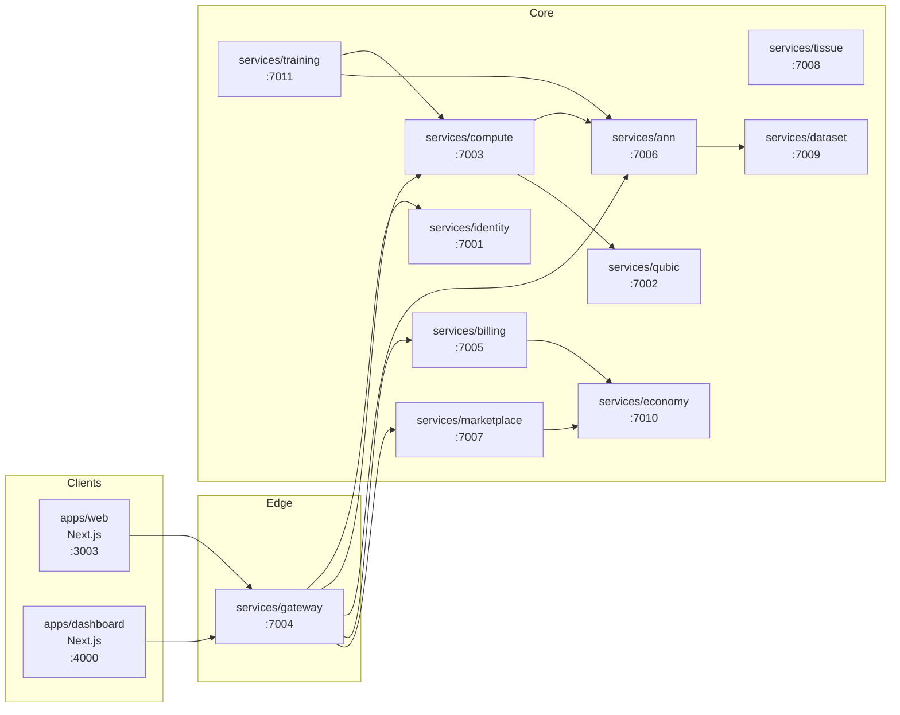
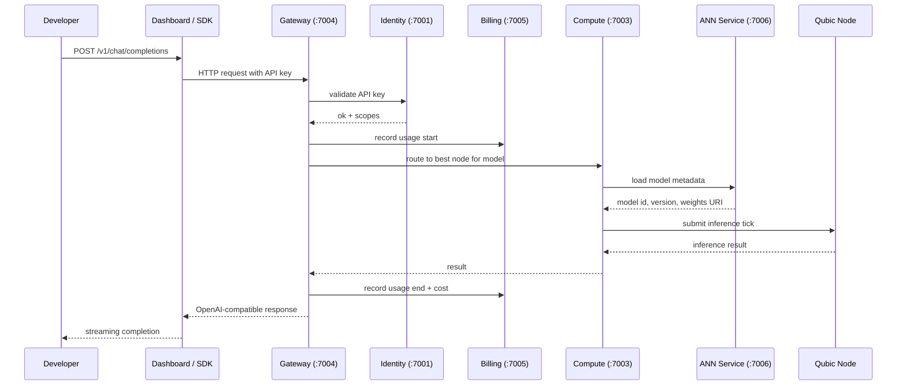
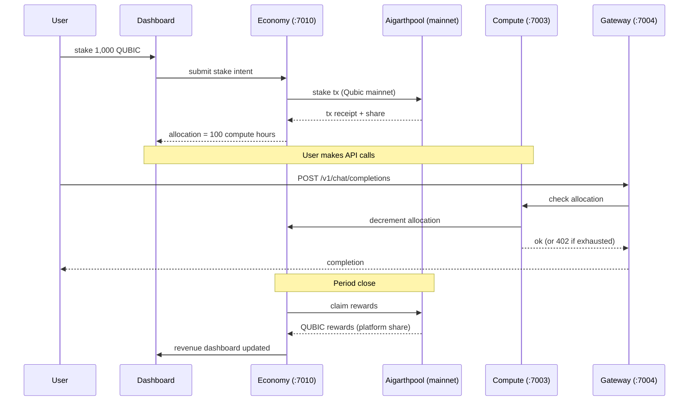

# Technology Stack

> Required section 3 of the Qubic Incubation Program proposal.
> See [`README.md`](./README.md) for the full proposal index and [`proposal.md`](./proposal.md) for the executive summary.

---

## 1. Front-end

- **Web app (`apps/web`):** Next.js 14 on the App Router, React 18, TypeScript, Tailwind CSS, shadcn/ui primitives, framer-motion for transitions. Marketing surface and authentication.
- **Dashboard (`apps/dashboard`):** Next.js 14, React 18, TypeScript, Tailwind CSS, shadcn/ui, TanStack Query for server state. Developer and enterprise console.
- **State:** server state via TanStack Query; client state via React hooks and Zustand for cross-component shared state.
- **Deployment target:** containerised Node.js, behind Cloudflare (or equivalent) for DDoS and edge caching.

## 2. Back-end

A microservices architecture, eleven services plus two apps:

| Service | Port | Responsibility |
|---|---|---|
| `services/identity` | 7001 | Auth, sessions, wallets, API keys, user accounts |
| `services/qubic` | 7002 | Qubic chain adapter, wallet operations, transaction submission |
| `services/compute` | 7003 | Compute scheduling, node operator registry, capacity management |
| `services/gateway` | 7004 | OpenAI-compatible API surface, request routing, rate limiting |
| `services/billing` | 7005 | Metering, invoicing, payment reconciliation |
| `services/ann` | 7006 | ANN registry, deployment, versioning, audit publication |
| `services/marketplace` | 7007 | ANN listings, compute listings, transactions, creator profiles |
| `services/tissue` | 7008 | Orchestration of complex multi-step AI workflows |
| `services/dataset` | 7009 | Training datasets, versioned and licensed |
| `services/economy` | 7010 | Wallets, staking ledger, aigarthpool settlement |
| `services/training` | 7011 | Training orchestrator, bridges to compute and ANN services |

All services are written in TypeScript on Node.js 20+ with Fastify, or in Rust where latency-critical. Service-to-service calls use HTTP/JSON internally; service-to-service auth uses an `INTERNAL_TOKEN` shared-secret bearer token on `/v1/internal/*` routes.

## 3. Data

- **Primary store:** Postgres 16 (managed), with per-service schemas. Drizzle ORM for typed access. Migrations are versioned and applied in CI.
- **Cache and session:** Redis 7.
- **Object storage:** MinIO (S3-compatible) for ANN weights, dataset files, model artifacts.
- **Message bus:** NATS for asynchronous service-to-service events (e.g. billing events from gateway).
- **Search (Milestone 2+):** Postgres full-text for the marketplace; we will adopt Meilisearch or Typesense if the marketplace volume justifies it.

## 4. Qubic Primitives

The platform's distinctive integration is with three Qubic primitives:

- **Useful Proof of Work (UPoW).** Inference and training workloads are submitted to node operators running Aigarth-aware Qubic nodes, so the work that secures the chain also produces AI output.
- **Artificial Neural Networks (ANNs).** The platform's ANN registry and marketplace wrap the in-protocol ANN primitive, providing a discoverable, monetisable surface.
- **Smart contracts (QX).** The aigarthpool staking and rewards contract is deployed to Qubic mainnet, with the smart contract audit (one covered by the program) completing before the contract is live.

## 5. Infrastructure

- **Container orchestration:** Docker Compose for local development; Kubernetes (managed, EKS or GKE) for production.
- **CI/CD:** GitHub Actions, with build, test, typecheck, and migration gates before merge. Container images pushed to a private registry.
- **Observability:** OpenTelemetry traces, Prometheus metrics, Grafana dashboards, structured logs shipped to a centralised store.
- **Secrets:** HashiCorp Vault (or AWS Secrets Manager / GCP Secret Manager) with rotation.
- **Local development:** the same `pnpm dev` command runs the entire stack, including Postgres, Redis, NATS, MinIO, and MailHog, via the `infrastructure/docker-compose.yml` at the repo root.

## 6. Security

- **Authentication:** email + password, magic link, and Qubic wallet signature, with HttpOnly + SameSite=Lax cookies for sessions.
- **Authorisation:** RBAC on the platform, with a separate auth surface for enterprise SSO (SAML and OIDC, Milestone 4).
- **API authentication:** scoped API keys with per-environment isolation, rate limiting, and revocation.
- **Smart contract security:** one audit covered by the program before mainnet deploy; re-audit on any contract change, paid by Aigarth Cloud.
- **Application security:** quarterly third-party pen test starting in Year 1, with findings published internally.
- **Operational security:** least-privilege IAM, mandatory MFA on all production access, hardware-key-based admin login.

## 7. Diagrams

Three diagrams. They render natively on github.com.

### 7.1 Service map

### 7.2 OpenAI-compatible request flow

### 7.3 QUBIC settlement and staking flow

## 8. Linked documents

- [`proposal.md`](./proposal.md) — executive summary and proposal index
- [`02-project-description.md`](./02-project-description.md) — what Aigarth Cloud is
- [`04-team-overview.md`](./04-team-overview.md) — who builds and reviews it
- [`05-milestones.md`](./05-milestones.md) — when each part of the stack ships
